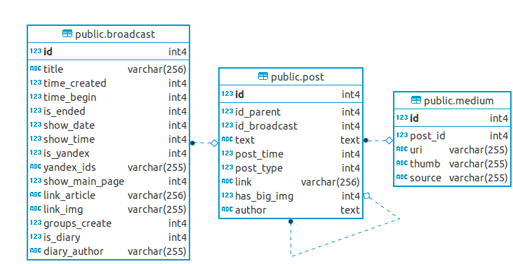

# Онлайн трансляции  (onlinebc_admin)

GraphQL и REST API онлайн трансляций.

- Тестовая страница API: <http://localhost:7777/> `GET`.

- JSON описание конечных точек GraphQL и REST API с параметрами запросов: <http://localhost:7777/routes> `GET`.

- Конечная точка GraphQL <http://localhost:7777/graphql> `POST`.
Документацию по типам данных, и возможным парамтрам запросов можно получить стандартными средствами GraphQL.


Требования к ПО
--------------

На компьютере разработчика должны быть установлены Docker, Docker-compose, Go.


Клонирование проекта на локальный компьютер
----------------------
    git clone git@git.rgwork.ru:web/onlinebc_admin.git ~/go/src
    cd ~/go/src/onlinebc_admin


Запуск Postgres и Redis
-----------------------   

Перед запуском приложения необходимо запустить Postgres и Redis

    docker-compose up -d    


Запуск приложения (для разработчиков onlinebc_admin)
-----------------
    go build && ./onlinebc_admin -serve 7777

или 
    ./run.sh    

Для просморта списка возможных параметров запустите программу без параметров.


Контроль запуска и доступности API 
-----------------------------------

В браузере откройте тестовую страницу доступного API: <http://localhost:7777>. 


Тесты
------
Запуск всех тестов

    go test -v ./...

Юнит тесты

    go test -v ./model/redis 
    go test -v ./model/db


Функциональные тесты (End to End). CRUD для таблиц Broadcast, Post, Medium сквозь GraphQL API 
и чтение  трансляций через REST API.

    go test -v

Параметр -v можно убрать если не нужен подробный вывод.


Сборка для фронтэнд разработчиков
----------------------------------------------

    ./build-frontend-container.sh

Скрипт `build-frontend-container.sh` генерирует образ приложения согласно `Dockerfile-frontend` 
и выгружает его в <https://hub.docker.com/>. Файл `docker-compose-frontend.yml` ссылается на этот образ 
и служит для запуска приложения фронтэнд разработчиками на локальных компьютерах. 

Порядок запуска приложения фронтэнд разаработчиками описан в файле <readme-frontend.md>.


Деплой
-------

Описание настроек для размещения программы на боевых серверах находится в файле <readme-production.md>.


---------------------


О программе
=====================

Данные
-------

Для хранения данных используется СУБД Postgres v11. 




Таблицы БД восстанавливаются и наполняются тестовыми данными при каждом запуске приложения.
- broadcast  - трансляции
- post  - посты к трансляциям. Таблица рекурсивно ссылается на саму себя для организации ответов к посту.
- medium - изображения к постам

Для обеспечения ссылочной целостности БД на таблицы `post` и `medium` наложены ограничения внешних ключей с каскадным удалением из подчиненных таблиц. Первичные ключи `id` автогенерируются. На все ключи построены индексы.


Описание полей таблиц находятся в файле `controller/controller-graphql.go`. Во время исполнеия могут быть получены стандартными средствами GraphQL. 


Файлы и директории
-------------------


    configs/

Содержит настроечные файлы соединений с Postgres и Redis. Файл `routes.yaml` описывает маршруты и возможные параметры запросов для тестовой страницы API <http://localhost:7777/>. Файл `routes-front.yaml` - усеченная версия файла `routes.yaml`, содержит маршруты публичного REST API для показа на страницах RG.RU, подключается вместо  `routes.yaml` если при запуске программы задан параметр `-front`.


    controller/

Файл `controller-graphql.go` содежит функции GraphQL API, `controller-rest.go` функции REST API.


    middleware/

Каждый запрос к программе обрабатывается двумя функциями middleware до того как будет обработан основным контроллером.

```
Жизненный цикл запроса

(req) --> HeadersMiddleware --> RedisMiddleware --> router --> controller --> (resp)
```
`HeadersMiddleware` добавляет json и возможно CORS HTTP заголовки к ответу сервера.  `RedisMiddleware` кэширует ответы сервера для публичных REST маршрутов начинающихся с `/api/` и возвращает кэшированные ответы клиенту.


    model/
        db/         - работа с базой данных
        redis/      - кэширование в  Redis
        img/        - масштабирование и сохранение загруженных изображений
        imgserver/  - перемещение изображений по ssh


Приложение не использует ORM. JSON форматирование в части REST API возложено на представления и функции postgres. Таким образом снижается трафик между БД и приложением, ускоряются запросы, снижается нагрузка на  хостирующий сервер, и уменьшается объем кода. 

Для формирования JSON в части GraphQL используется библиотека <github.com/jmoiron/sqlx>, что позволило применить отображения (map) вместо структур и избавиться от описания типов БД в коде Go. Это уменьшает связность  БД и приложения, позволяет менять структуру базы данных без необходимости вносить изменения в код go приложения и уменьшает объем кода.


    router/

Cопосталяет маршруты функциям-контроллерам, присоединяет middleware, и запускает сервер. Сами маршруты с именами соответствующих функций вынсены в настроечные файлы `configs/routes.yaml` и `routes-front.yaml`.


    migrations/
        create-tables.sql
        create-views-and-functions.sql
        add-data.sql

Директория содержит SQL скрипты для порождения таблиц базы данных если таковые отсутствуют, а так же представлений и функций. Скрипт `add-data.sql` наполняет базу данных тестовыми данными с идентификаторами трансляций между `321` и `354`. Все три скрипта выполняются при каждом запуске программы, так что программа будет корректно работать даже при изначально пустой базе данных.


**Второстепенные файлы**


    etc/
        .pgpass

Файл используется контейнером db Postgres, чтобы не вводить пароли при дампе и восстановлении базы данных.


    templates/


Шаблоны приветственного сообщения приложения и тестовой страницы API <http://localhost:7777/>.


    docs/

Файлы для документации и проч.


    pgdata/

Директория где postgres хранит файлы базы данных. Может быть удалена. Восстанавливается при каждом новом запуске приложения.


    uploads_temp/

Временная директория для хранения загруженных изображений.

    uploads_temp/

Директория для хранения загруженных изображений. Разделяется с 


    docker-compose.yml     
    main.go
    readme-frontend.md           # Для фронтэнд разработчиков
    readme-production.md         # Для админов
    README.md                    # Этот файл
    build-frontend-container.sh* # Скрипт сборки докер контейнера для фронтэнд разработчиков
    Dockerfile-frontend          # Используется в build-frontend-container.sh
    docker-compose-frontend.yml  # Файл запуска для фронтэнд разработчиков. 
    TODO.md                      # Недоделки


-------------------------------------------------------

Другие команды
--------------------


Просмотр состояния базы данных


Postgres доступен на localhost:5432.

Если блок adminer раскомментирован в `docker-compose.yml`, то в браузере откройте <http://localhost:8080>. 

Параметры доступа:
- System: PostgreSQL,
- Server: db,
- Username: root,
- Password: root,
- Database: onlinebc


Останов базы данных
    
    docker-compose down


Удаление файлов базы данных после останова docker-compose

    sudo rm -rf  pgdata


Дамп базы данных в файл в директорию `migrations/`.
  
    docker exec -it psql-com pg_dump --file /dumps/onlinebc-dump.sql --host "localhost" --port "5432" --username "root"  --verbose --format=p --create --clean --if-exists --dbname "onlinebc"


Восстановление БД из дампа в `migrations/`.

    docker exec -it psql-com psql -U root -1 -d onlinebc -f /dumps/onlinebc-dump.sql


Дамп схемы БД

    docker exec -it psql-com pg_dump --file /dumps/onlinebc-schema.sql --host "localhost" --port "5432" --username "root" --schema-only  --verbose --format=p --create --clean --if-exists --dbname "onlinebc"


Дамп только данных таблиц.

    docker exec -it psql-com pg_dump --file /dumps/onlinebc-data.sql --host "localhost" --port "5432" --username "root"  --verbose --format=p --dbname "onlinebc" --column-inserts --data-only --table=broadcast --table=post --table=medium


Можно добавить  -$(date +"-%Y-%m-%d--%H-%M-%S") к имени файла для приклеивания штампа даты-времени.


Показ структуры таблицы TABLE_NAME

    docker-compose exec db pg_dump -U root -d onlinebc -t TABLE_NAME --schema-only


Командная строка Postgres

	docker-compose exec db psql -U root onlinebc


Командная строка Redis

    docker-compose exec redis redis-cli


